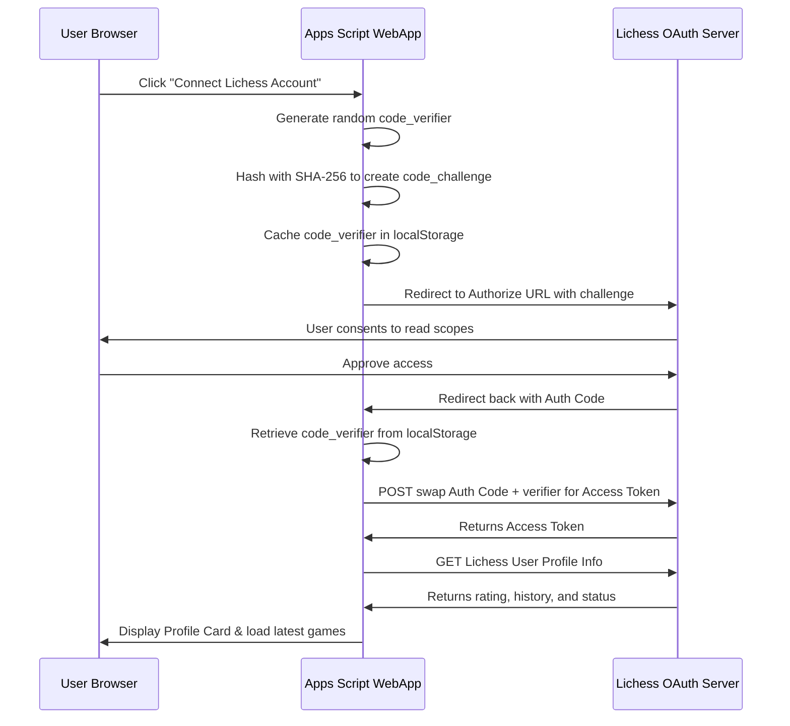
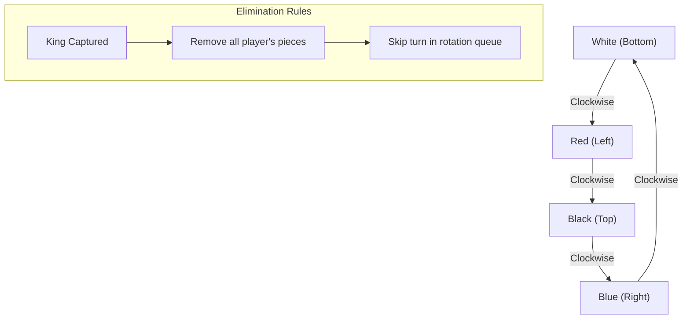

# ♟️ Chess Pro & Chess-Variance

[-d8572a?style=flat&logo=lichess&logoColor=white)](https://lichess.org/api)

A serverless, high-performance, full-featured Chess platform running entirely on **Google Apps Script (GAS)**. Chess Pro supports traditional 2-player chess (local, vs. computer, puzzle solving, and online multiplayer) alongside advanced features like the custom **4-Player Chess Variant** and safe **Lichess OAuth 2.0 PKCE Integration**.

---

## 🚀 Key Features

### 🎮 Gameplay Modes
*   **Play Online (Real-time Multiplayer):** Instant matchmaking or custom invite codes powered by serverless polling using GAS `CacheService` and `LockService`.
*   **Play Computer (AI Bots):** Challenge 8 bot profiles ranging from Jimmy (400 ELO) to Magnus (3200 ELO) powered by client-side Stockfish WASM.
*   **Pass & Play (Local 2-Player):** Play standard chess locally with automatic board-flipping options.
*   **4-Player Local Variant:** Challenge friends in a custom four-player layout on a $14 \times 14$ board with clockwise turn rotation and king-capture elimination rules.
*   **Tactical Puzzles:** Curated datasets of real-world tactics with progressive difficulty levels.

### ⚡ Professional Analysis & UI
*   **One-Click Game Review:** Professional centipawn accuracy check that classifies moves (Brilliant, Great, Best, Excellent, Good, Book, Inaccuracy, Mistake, Blunder) utilizing a sigmoid-based curve.
*   **Dynamic Eval Bar:** Real-time visual representation of the current engine evaluation.
*   **Interactive Visualizations:** Draw tactical lines (arrows) and highlights (circles) directly on the board via right-click drags.
*   **Smooth FLIP Animations:** Responsive and hardware-accelerated piece-sliding transitions. Piece rotation is dynamically managed to keep pieces upright on both normal and flipped boards.

---

## 🛠️ Technical Architecture

### 1. Multiplayer Synchronization Flow (GAS Backend)
Multiplayer matches run serverless without a traditional persistent WebSocket or SQL backend.
*   **Fast-Path Cache:** Room states are stored in GAS `CacheService` using minimized key mappings to reduce latency.
*   **Atomic Concurrency:** GAS `LockService` locks access on every move validation, preventing race conditions or double-moves.
*   **Optimistic Polling:** Version-based fast-polling reads only modified room updates rather than requesting the entire room configuration.

### 2. Client-Side Stockfish Engine
*   **WASM Worker Threading:** To prevent interface locking, Stockfish compiles in WebAssembly and runs inside a browser `Web Worker`.
*   **AI Profiles:** Bot difficulty levels are dynamically configured by restricting search depth, maximum time per move, and engine calculation threads.

### 3. Dynamic Vector Transformations (4-Player Pieces)
Instead of loading massive SVG sets for every player color, the platform dynamically recolors White piece templates inside the client browser:
*   Red and Blue variants replace the `fill='%23fff'` properties in base64 SVG paths with `#ff3b30` and `#007aff` on-the-fly, adapting beautifully to Classic, Neon, Wood, and Carbon board themes.

---

## 🌐 Lichess OAuth 2.0 PKCE Integration

The platform integrates with Lichess using the **Proof Key for Code Exchange (PKCE)** protocol. This eliminates the need for manual API tokens.

---

## 👑 4-Player Chess Rules & Mechanics

The 4-player variant features unique layout and elimination logic:

*   **Custom Board Geometry:** A scaled $14 \times 14$ grid. The corner $3 \times 3$ grid areas are rendered transparent and disabled.
*   **Piece Setups:** White sits at the bottom, Red at the left, Black at the top, and Blue at the right. Pawns move in the respective forward direction of each player.
*   **King Capture:** There is no traditional checkmate. If a player's King is captured, they are eliminated. Their remaining pieces vanish instantly from the board, and their future turns are skipped.

---

## 📂 Project Structure

| File | Type | Description |
| :--- | :--- | :--- |
| [`Code.gs`](file:///home/u0_a763/Chess-Variance/Code.gs) | Server | Server-side endpoints for multiplayer lobbies, matchmaking, and state persistence. |
| [`Index.html`](file:///home/u0_a763/Chess-Variance/Index.html) | View | Root DOM structure, system modals, and tab layouts. |
| [`App.html`](file:///home/u0_a763/Chess-Variance/App.html) | Controller | Core game loop, local rules engine, Lichess PKCE authorization, and board interactions. |
| [`Stylesheet.html`](file:///home/u0_a763/Chess-Variance/Stylesheet.html) | Style | CSS variables, responsive viewport metrics, board themes, and animation specs. |
| [`AI.html`](file:///home/u0_a763/Chess-Variance/AI.html) | Worker | Bot ELO configurations and depth thresholds. |
| [`Engine.html`](file:///home/u0_a763/Chess-Variance/Engine.html) | Analysis | Logic wrapper managing evaluation bars, centipawn graphs, and move classification. |
| [`Stockfish.html`](file:///home/u0_a763/Chess-Variance/Stockfish.html) | Engine | Stockfish WASM binaries wrapped for deployment in Google Apps Script. |
| [`PuzzleGen.html`](file:///home/u0_a763/Chess-Variance/PuzzleGen.html) | Data | Tactical puzzle engine, database, and scoring feedback. |
| [`Pieces.html`](file:///home/u0_a763/Chess-Variance/Pieces.html) | Asset | Base64 SVG paths for chess piece graphics. |

---

## 📦 Deployment Instructions

Because the platform runs inside Google Apps Script, you can deploy it in minutes:

### Option A: Standard Google Script Editor
1.  Go to [script.google.com](https://script.google.com/) and create a new project.
2.  Copy the contents of [`Code.gs`](file:///home/u0_a763/Chess-Variance/Code.gs) into the code file.
3.  Create new HTML files inside the editor for each of the HTML files in this repository (e.g., `Index`, `App`, `Stylesheet`, `Pieces`, etc.) and paste their respective codes.
4.  Click **Deploy > New deployment**.
5.  Select **Web app**:
    *   **Execute as:** `Me`
    *   **Who has access:** `Anyone`
6.  Authorize the permissions and copy your web app URL.

### Option B: Local CLI Development (`clasp`)
If you develop locally, you can use Google's `clasp` utility:
1.  Install clasp globally: `npm install -g @google/clasp`.
2.  Login: `clasp login`.
3.  Clone or link your Apps Script project: `clasp clone <scriptId>`.
4.  Deploy your changes from local directory: `clasp push`.

---

## 📄 License & Attributions
-   **License:** MIT License.
-   **Stockfish Team:** Powered by [Stockfish Chess Engine](https://stockfishchess.org/).
-   **Lichess Team:** Powered by [Lichess open API](https://lichess.org/).
